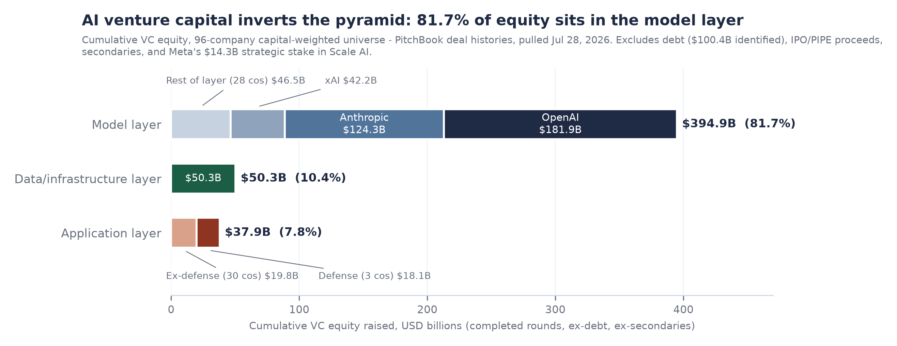

# AI Venture Capital by Stack Layer

**Model layer vs. data/infrastructure layer vs. application layer**
Prepared July 28, 2026. All data from PitchBook (profiles, deal histories, research reports) pulled July 28, 2026. Amounts in USD millions unless noted.

---

## The headline

Cumulative venture equity deployed into the 96-company capital-weighted AI universe totals **$483.1B**, and it splits:

| Layer | VC equity deployed | Share | Companies |
|---|---:|---:|---:|
| Model layer | $394,870M | 81.7% | 31 |
| Data/infrastructure layer | $50,325M | 10.4% | 32 |
| Application layer | $37,906M | 7.8% | 33 |
| **Total** | **$483,100M** | 100% | **96** |

Three facts control the whole picture:

1. **AI venture capital is functionally a frontier-lab financing market.** OpenAI ($181.9B), Anthropic ($124.3B), and xAI ($42.2B) account for $348.3B of equity raised, which is 88.2% of the model layer and 72.1% of every VC dollar in the universe. This matches PitchBook's top-down finding that the same three companies took 67.3% of global Q1 2026 AI deal value ($172B of $255.5B).
2. **The application layer boom is a deal-count phenomenon, not a dollar phenomenon.** PitchBook counted 4,609 vertical-application deals in 2025 against 1,821 horizontal-platform deals, yet applications captured only about a quarter of dollars in the quarters where PitchBook published the split (Q1 2025: $19.2B of ~$73B). Bottom-up, the entire non-defense application cohort here has raised $19.8B of equity, cumulatively, ever: less than OpenAI raised in any single quarter of 2026.
3. **Equity is no longer the whole capital story.** This universe carries an additional ~$100.4B of identified debt and non-VC capital (Anthropic $37.0B chip-purchase debt, CoreWeave ~$29.3B GPU-backed facilities, Databricks $9.1B, Nebius $8.8B, xAI $5.0B, OpenAI $4.5B, Lambda $1.8B, Cerebras $1.7B, Crusoe $1.4B, Mistral $1.0B). Any "capital deployed into AI" claim that mixes these with VC equity overstates venture exposure by roughly a fifth.

## Scope and construction (read before citing)

"Every single AI company" is not an enumerable set: PitchBook tracks tens of thousands of AI-tagged companies (9,262 AI deals globally in 2024 alone), and the PitchBook connection used here resolves named entities rather than running attribute screens. The defensible construction, used here, is:

- **Top-down**: PitchBook's published totals for the full AI universe (below), which capture every company.
- **Bottom-up**: company-level deal reconciliation for the 96 companies that dominate dollars deployed. AI VC is extreme power-law: PitchBook's own concentration work shows the top 10 US deals took 41.2% of all US VC in 2025, and the three frontier labs took two-thirds of global Q1 2026 AI value. The long tail this build omits is thousands of companies but a minority of dollars, concentrated in the application layer; see Reconciliation.

**Counting rules** (applied per company, per deal): VC equity includes completed VC and growth rounds including corporate/strategic participation booked by PitchBook inside VC rounds (Microsoft in OpenAI, Google/Amazon in Anthropic, Nvidia widely). Excluded from equity: debt facilities and term loans, IPO proceeds and PIPEs (Zhipu, MiniMax, Cerebras, CoreWeave, Nebius), secondaries and tenders (confirmed excluded from PitchBook Total Raised by deal-level reconciliation at OpenAI and Anthropic), grants, founder capitalizations (Figure $100M, Baichuan $50M), and announced-but-unclosed rounds (Cohere $600M Series E, Reflection $2.5B Series C, Mistral EUR 3B, Poolside $2B, Physical Intelligence ~$1B, Crusoe $3B, Databricks' in-progress round at $188B post, Anysphere's in-progress $2B, Lovable's rumored $300M, among others).

**Judgment calls, shown both ways:**
- **Meta's $14.3B for 49% of Scale AI** is booked by PitchBook as a VC round. It is corporate-strategic, not fund capital: excluded from the headline (infra becomes $64.6B and the grand total $497.4B if included).
- **Defense AI (Anduril $11.9B, Shield AI $2.9B, Helsing $3.3B)** is inside the application layer per PitchBook's AI universe but flagged: ex-defense, the application layer is $19.8B and the layer split becomes 84.9 / 10.8 / 4.3.
- **Nebius** is excluded from equity totals (Yandex-heritage carve-out; no meaningful pre-IPO VC history; ~$8.8B debt and $1.7B public-market equity noted).

## Top-down context (full PitchBook AI universe, all layers)

| Metric | Value | Period / geography | Source |
|---|---:|---|---|
| Global AI/ML VC deal value | $141.1B / 9,262 deals | 2024, global | Q4 2024 AI & ML VC Trends |
| Global AI/ML VC deal value | $254.4B | 2025, global | Q1 2026 AI VC Trends (via PB News) |
| Global AI/ML VC deal value | $255.5B / 1,546 deals | Q1 2026 alone, global | Q1 2026 AI VC Trends |
| AI share of all VC dollars | ~25% | 2024, global | Q1 2025 AI & ML VC Trends |
| AI share of all VC dollars | 65.4% of value | 2025, US | Q4 2025 PitchBook-NVCA Venture Monitor |
| AI VC deal value | $355.9B = 86% of all US VC | H1 2026, US | Q2 2026 PitchBook-NVCA Venture Monitor |
| AI share, Europe | 60.3% of value (EUR 26.5B) | H1 2026, Europe | Q2 2026 European Venture Report |
| China AI VC | ~$10-11B/yr; ~20% of China VC | 2024 and 2025 | Q2 2026 China AI Analyst Note |
| Horizontal platforms (dollars) | ~$50B / 425 deals (~68-70% of capital) | Q1 2025, global | Q1 2025 AI & ML VC Trends |
| Vertical applications (dollars) | $19.2B / 1,022 deals (~26% of capital) | Q1 2025, global | Q1 2025 AI & ML VC Trends |
| Deal counts, full year | Vertical apps 4,609 vs. horizontal 1,821 | 2025, global | PB News AI market map (2026-03-20) |

PitchBook does not publish a clean global dollar split across model / infrastructure / application (its taxonomies cut horizontal vs. vertical, plus semiconductors and autonomous machines; a 209-node stack taxonomy launched in 2026 without published dollar aggregates). The three-layer split in this report is therefore built bottom-up and reconciled against these totals.

## Model layer: $394.9B (81.7%)

Foundation and frontier model developers: general, code, media/audio, world/embodied, and the Chinese LLM cohort.

| Company | VC equity | Last round | Post-money | Status note |
|---|---:|---|---:|---|
| OpenAI | $181,917M | $122,000M (Mar 2026) | $852,000M | In IPO registration (Sep 2026 expected); +$4.5B debt |
| Anthropic | $124,254M | $65,000M Series H (May 2026) | $965,000M | In IPO registration (Oct 2026 expected); +$37.0B debt |
| xAI | $42,163M | $20,000M Series E (Jan 2026) | $230,000M | Acquired by SpaceX Feb 2026 at $250B; +$5.0B debt |
| Moonshot AI | $7,992M | $2,000M Series D (May 2026) | $20,000M | HKEX IPO filed Mar 2026 |
| Safe Superintelligence | $7,000M | $6,000M (Apr 2025) | $32,000M | No product, two rounds |
| StepFun | $3,070M | ~$2,500M (May 2026) | n/d | PB coverage begins late 2024; understated |
| Mistral AI | $3,037M | $1,985M Series C (Sep 2025) | $13,664M | Apple acquisition talks; +$973M debt |
| Figure AI | $2,245M | $1,500M Series C (May 2025) | $39,000M | Embodied |
| Skild AI | $2,214M | $1,400M Series C (Jan 2026) | $14,000M | Embodied |
| Reflection AI | $2,155M | $2,000M Series B (Oct 2025) | $8,000M | $2.5B Series C in progress at $27.5B, excluded |
| Thinking Machines Lab | $2,000M | $2,000M seed (Jun 2025) | $10,000M | Largest seed in venture history |
| Cohere | $1,640M | $700M Series D1 (Sep 2025) | $7,000M | Acquiring Aleph Alpha; $600M Series E announced |
| Inflection AI | $1,565M | $1,300M Series B (Jun 2023) | $4,000M | Dormant since 2023 Microsoft team-hire |
| Zhipu AI | $1,536M | pre-IPO VC (derived) | $6,573M at IPO | Public HKG:02513 Jan 2026 |
| MiniMax | $1,390M | pre-IPO VC (derived) | $6,556M at IPO | Public HKG:00100 Jan 2026 |
| World Labs | $1,108M | $1,000M Series C (Feb 2026) | $5,400M | $183M embedded debt netted |
| Physical Intelligence | $1,071M | $600M Series B (Nov 2025) | $5,400M | ~$1B Series C upcoming, excluded |
| Magic | $1,016M | ~$550M Series D (Jul 2025) | $3,800M (est.) | Sizes estimated by PB |
| Baichuan AI | $989M | undisclosed (Apr 2025) | $2,754M (Jul 2024) | |
| Luma AI | $967M | $900M Series C (Nov 2025) | $4,000M | HUMAIN-led |
| ElevenLabs | $850M | $500M Series D (Feb 2026) | $11,000M | ~$22B secondary rumored |
| Runway | $844M | $315M Series E (Feb 2026) | $5,300M | $15M debt netted |
| Suno | $819M | ~$400M Series D (Jun 2026) | $5,400M | Size estimated |
| AI21 Labs | $637M | $300M Series D (May 2025) | $1,400M | Nebius acquisition cancelled |
| Poolside | $623M | $500M Series B (Oct 2024) | $3,000M | Seeking $2B at $12B pre |
| Aleph Alpha | $520M | ~$486M (Nov 2023) | n/d | Pending acquisition by Cohere |
| Sakana AI | $444M | $200M Series B (Nov 2025) | $2,650M | |
| Imbue | $246M | $212M Series B (Oct 2023) | $1,000M | Dormant |
| 01.AI | $200M | undisclosed (Aug 2024) | $1,000M (Dec 2023) | Materially understated (undisclosed round) |
| Character.AI | $193M | ~$150M (May 2023) | $1,000M | 2024 Google $2.5B licensing not booked as financing |
| Reka AI | $168M | $110M Series B (Jul 2025) | $1,000M (est.) | |

Layer observations: the two IPO registrants (OpenAI, Anthropic) hold $306.2B of the layer's $394.9B; frontier-lab funding has decisively shifted toward sovereign wealth (PitchBook: 59 SWF AI deals worth $59.7B in 2025 YTD-Oct) and structured debt (Anthropic's $34.5B chip-financing facility). Non-frontier model companies (everything below xAI) sum to just $46.5B, and the 2023 mid-tier cohort (Inflection, Character, Imbue, Aleph Alpha, AI21) is functionally exited or dormant: model-layer consolidation is complete outside the top table.

## Data/infrastructure layer: $50.3B (10.4%)

AI cloud/compute, chips, data platforms, data labeling and human data, and MLOps/serving/tooling.

| Company | Subsegment | VC equity | Last round | Post-money | Status note |
|---|---|---:|---|---:|---|
| Databricks | data platform | $20,412M | $7,000M Series L (Feb 2026; $5B equity + $2B loan) | $136,000M | Coatue round in progress at $188B; +$9.1B debt |
| Groq | chips | $3,353M | $750M D2 (Aug 2025) | n/d | Acquired by Nvidia Feb 2026 for $20B |
| Cerebras | chips | $2,923M | $1,100M Series H (Jan 2026) | pre-IPO | Public May 2026; IPO raised $6.4B at $40.6B |
| Crusoe | cloud | $2,769M | $1,375M Series E (Oct 2025) | $10,000M | +$1.4B debt; seeking $3B at $30B |
| SambaNova | chips | $2,483M | $1,000M Series F (Jul 2026) | $11,000M | Mar 2026 down round (~$2B), then rebound |
| Lambda | cloud | $2,373M | $1,500M Series E (Nov 2025) | $5,434M | +$1.8B debt; pre-IPO round pending |
| Baseten | tooling | $2,085M | $1,500M Series F (Jun 2026) | $13,000M | $2.15B to $13B post in ~9 months |
| Fireworks AI | tooling | $1,827M | $1,500M Series D (Jul 2026) | $17,500M | ~$1B 2026E revenue run-rate |
| Scale AI | labeling | $1,603M | $1,000M Series F (May 2024) | $13,800M | Meta bought 49% for $14.3B (Jun 2025), held separately |
| CoreWeave | cloud | $1,590M | $1,100M Series C (Nov 2024) | $19,000M (final private) | Public Mar 2025; ~$29.3B GPU-backed debt |
| VAST Data | data platform | $1,398M | $1,000M Series F (Oct 2025) | $30,000M | Nvidia-led |
| Together AI | cloud | $1,338M | $800M Series C (Mar 2026) | $8,300M | Aramco-affiliated lead |
| Tenstorrent | chips | $1,034M | $699M Series D (Dec 2024) | $2,600M | Qualcomm acquisition talks |
| Etched | chips | $1,010M | $300M Series C (Jul 2026) | $10,300M | Seeking $20B post next |
| Lightmatter | chips | $821M | Series D (Dec 2025, n/d) | $4,500M (Oct 2024) | |
| Mercor | labeling | $519M | $385M Series C (Oct 2025) | $10,000M | $20B talks (rumor) |
| Modal | tooling | $465M | $355M Series C (May 2026) | $4,650M | |
| Hugging Face | tooling | $395M | undisclosed (Dec 2025) | $4,500M (Aug 2023) | |
| Others (14 cos) | | $1,930M | | | Turing, Snorkel, W&B (acq. CoreWeave $1.7B), Anyscale, Labelbox, Invisible, LangChain, Pinecone, Prime Intellect, Foundry/Mithril, LlamaIndex, Weaviate, Surge AI ($0: bootstrapped, $1.4B revenue), Nebius (excluded) |

Layer observations: the equity number radically understates capital flowing into this layer because the neoclouds finance GPUs with debt (CoreWeave alone ~$29.3B, an 18:1 debt-to-VC-equity ratio) and the biggest checks arrived as non-VC events: Meta-Scale $14.3B, Nvidia-Groq $20B acquisition, Cerebras' $6.4B IPO. Full-stack capital into these 32 companies exceeds $110B once debt and public-market raises are counted. The 2025-26 re-rate concentrated in inference/serving (Baseten, Fireworks, Etched, Modal) while the 2021-23 tooling cohort (Pinecone, Anyscale, Labelbox, Snorkel) is flat or PE-recapped: the picks-and-shovels trade rotated from training to inference.

## Application layer: $37.9B (7.8%) — $19.8B ex-defense

AI-native applications: coding, search/productivity, enterprise agents, healthcare, legal/finance, creative, defense.

| Company | Subsegment | VC equity | Last round | Post-money | Status note |
|---|---|---:|---|---:|---|
| Anduril | defense | $11,870M | $5,000M Series H (May 2026) | $61,000M | Edge-of-universe flag |
| Anysphere (Cursor) | coding | $3,376M | $2,300M Series D (Nov 2025) | $29,300M | Pending $60B SpaceX all-stock acquisition |
| Helsing | defense | $3,311M | $1,800M Series E (Jul 2026) | $18,000M | Edge-of-universe flag |
| Shield AI | defense | $2,910M | $1,500M Series G (Mar 2026) | $12,700M | Edge-of-universe flag; $250M debt netted |
| Cognition (Devin) | coding | $1,738M | $1,000M Series D (May 2026) | $26,000M | Acquired Windsurf Jul 2025 |
| Perplexity | search | $1,710M | $200M Series E ext (Sep 2025) | $20,000M | $1B TTM revenue |
| Superhuman (fka Grammarly) | productivity | $1,414M | $1,022M (Apr 2026) | $13,000M (2021, stale) | |
| Sierra | agents | $1,435M | $950M Series E (May 2026) | $15,800M | $150M debt netted |
| Harvey | legal | $1,113M | $200M (Mar 2026) | $11,000M | $75M debt netted |
| Replit | coding | $878M | $400M Series D (Mar 2026) | $9,000M | |
| Vercel | coding | $863M | $300M Series F (Sep 2025) | $9,300M | |
| OpenEvidence | healthcare | $795M | $250M Series D (Mar 2026) | $12,000M | |
| Abridge | healthcare | $780M | $316M Series E (Jun 2025) | $5,300M | |
| Glean | search | $765M | $150M Series F (Nov 2025) | $7,200M | |
| Lovable | coding | $648M | $425M Series B (Dec 2025) | $6,941M | $13.2B round is rumor-status |
| Others (18 cos) | | $4,299M | | | Synthesia, Decagon, Hippocratic, EvenUp, Rogo, Writer, Ambience, Cresta, Windsurf (acq.), Mirage, Clay, Pika, Hebbia, StackBlitz, HeyGen, Photoroom, /dev/agents, Midjourney ($0: bootstrapped, $500M revenue) |

Layer observations: ex-defense, the entire application layer has raised less equity ($19.8B) than Anthropic's single May 2026 round ($65B). Yet this is where revenue traction is broadest relative to capital: Cursor $6B TTM revenue on $3.4B raised, Perplexity $1B on $1.7B, OpenEvidence $300M on $0.8B, and two of the most revenue-efficient AI companies anywhere took zero venture money (Midjourney $500M revenue, Surge AI $1.4B revenue). Capital efficiency inverts up the stack: the layer with the least VC deployed generates the most revenue per dollar raised.

## Reconciliation: bottom-up vs. top-down

PitchBook's top-down series implies roughly $650B of global AI VC deployed across 2024, 2025, and Q1 2026 alone ($141.1B + $254.4B + $255.5B), plus ~$95B in 2023 and smaller prior years. This bottom-up build captures $483.1B cumulative (all years) across 96 companies. The gap is the long tail: thousands of smaller application and vertical-AI deals (PitchBook counted 4,609 vertical-app deals in 2025 at a median well under $15M), China's broader ecosystem, and companies outside this universe. Directionally the reconciliation is tight where it matters: the frontier-three's $348.3B bottom-up equity is consistent with PitchBook's reporting that they alone took ~$172B in Q1 2026 and $50B+ in 2025. Conclusion: the long tail raises the application layer's dollar share of the full universe above this build's 7.8% (PitchBook's Q1 2025 snapshot put vertical applications at ~26% of that quarter's dollars), but no plausible tail allocation changes the ordering: the model layer dominates dollars, infrastructure raises modest equity against enormous debt, and applications win deal count while a minority of dollars follows.

## What it means, and what to do with it

**What happened:** venture capital in AI has inverted the classic pyramid. In prior platform shifts, capital spread across thousands of application builders sitting on cheap shared infrastructure. Here, 81.7% of tracked equity sits in the layer that builds the models, three companies hold 72% of everything, and the infrastructure layer's real financing has migrated to debt markets and corporate strategics.

**What it means:** (1) LP exposure to "AI" is overwhelmingly exposure to three balance sheets and their IPO timing: OpenAI (Sep 2026 expected) and Anthropic (Oct 2026 expected) registrations are the single largest liquidity events in venture history and will reprice the whole asset class's DPI math. (2) The application layer is structurally under-capitalized relative to its revenue traction, which is why 2026 valuation step-ups there (Cursor to $29.3B and a $60B exit, Cognition to $26B, Baseten to $13B) are the sharpest in the dataset: capital is repricing scarcity of proven revenue, not funding compute. (3) The debt layer ($100B+ identified) is the unpriced risk: GPU-collateralized and chip-purchase-linked facilities sit outside most VC risk models but fund the same capex race.

**Second order / what consensus misses:** the standing narrative says "value accrues to applications." The dollars say venture investors are still making the opposite bet at 10:1 odds. One of those positions is wrong. If model-layer capability commoditizes (open-weights pressure, inference price collapse), $395B of equity is levered to pricing power that applications like Cursor are already arbitraging; if it does not commoditize, the application layer's margins are on borrowed time. Watch three falsifiers through year-end 2026: OpenAI/Anthropic IPO pricing vs. final private marks, whether Meta-Scale-style corporate strategics replace VC in the infra layer entirely, and whether ex-defense application-layer share of new dollars breaks above ~25% for two consecutive quarters.

## Data quality register (freeze-on-conflict items)

- PitchBook's 2025 global quarterly figures sum to ~$230.5B vs. the $254.4B FY figure cited in Q1 2026 reporting; restatement noise. FY figure used.
- Zhipu AI and Moonshot AI equity/debt splits are derived from profile fields (deal-level pulls rate-limited); flagged, not deal-reconciled.
- 01.AI and StepFun totals are understated (undisclosed and untracked rounds respectively, per PitchBook's own records).
- SambaNova's deal history contains a completed $5B M&A entry (Jan 2026) inconsistent with its continued private status and later rounds; treated as a data artifact.
- Weaviate's $50M Series B carries a PitchBook date (Feb 2026) conflicting with contemporaneous reporting (Apr 2023); PitchBook date carried as-is.
- Luma AI's Series C shows conflicting dates (Nov 2025 deal date vs. Jan 2026 financing note).
- Shield AI's identified debt ($250M) is a floor; earlier venture-debt tranches are not itemized.
- Superhuman/Grammarly's ~$1B non-dilutive General Catalyst facility is not broken out in PitchBook's total.
- Estimates flagged by PitchBook itself: Magic Series D size/valuation, Suno Series D size, Skild post-money, Reka post-money, Helsing post-money.

## Sources

Company-level: PitchBook profiles and deal histories for all 96 companies (PBIDs in `data/companies.csv`), pulled 2026-07-28. Aggregates: PitchBook Q4 2024, Q1 2025, Q3 2025, Q4 2025, Q1 2026 AI & ML VC Trends; Q3 2025 and Q4 2025 PitchBook-NVCA Venture Monitor; Q2 2026 PitchBook-NVCA Venture Monitor; Q1 2026 Analyst Notes (Ranking the AI Giants; VC Investment in Consumer AI; Tracking AI Venture Activity in APAC Part II); Q2 2026 Analyst Notes (Where Capital Is Flowing in China's AI Market; The SaaS-Pocalypse Opportunity); Q3 2025 Quantitative Perspectives; Q4 2025 Analyst Note on market concentration; PitchBook News (2025-08-08, 2025-10-07, 2026-03-20, 2026-05-12). Full links in `data/topdown_aggregates.md`.

**Reproduction:** `python3 build/summarize.py` regenerates `data/companies.csv` and every layer total above from the three layer datasets in `data/`.
